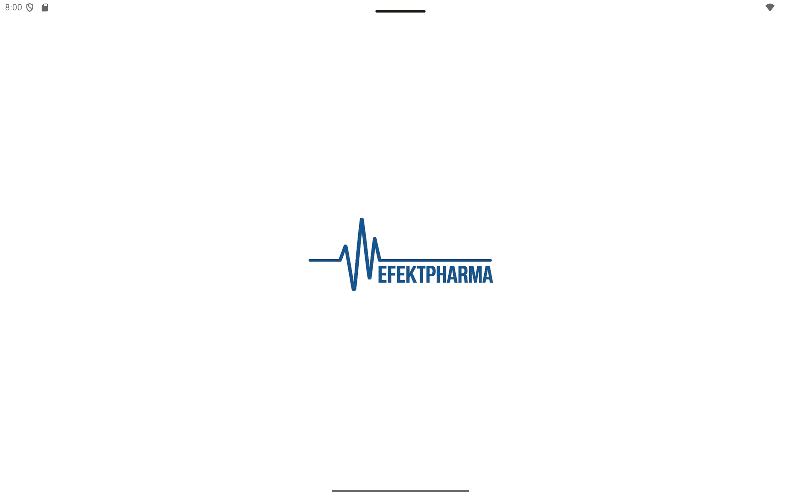
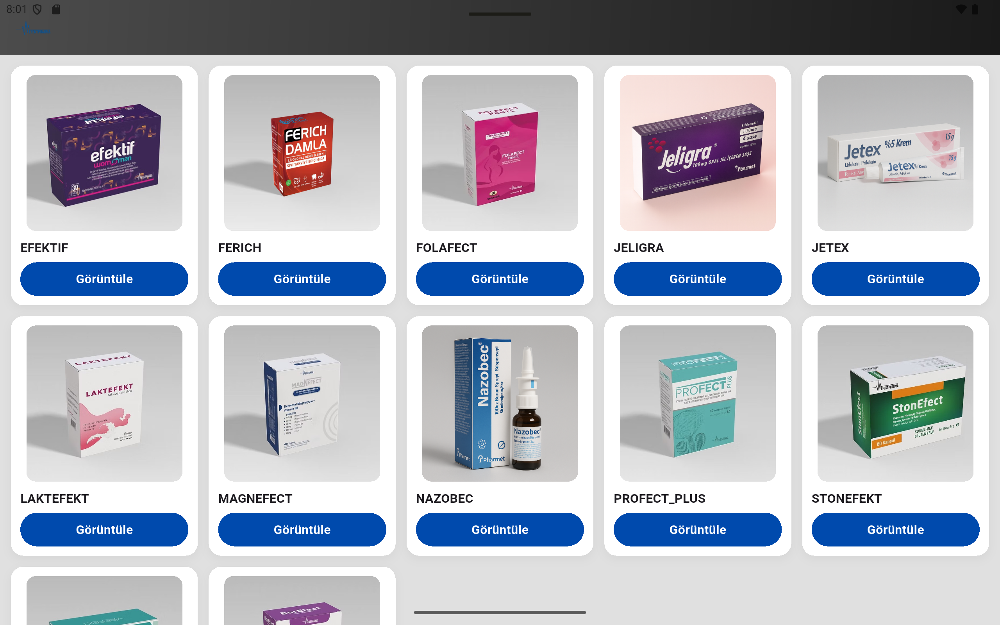
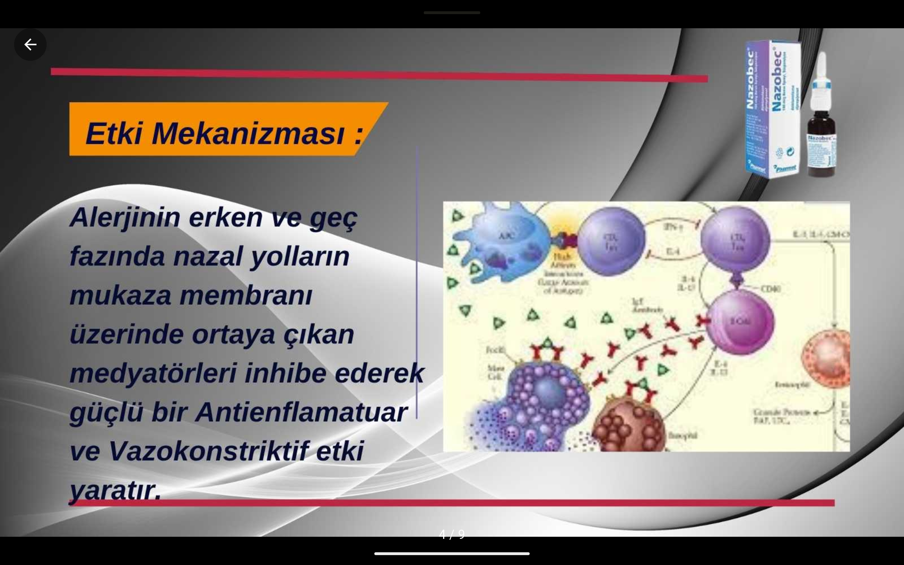

<h1 align="center">EfektPharma – Product Catalog App (Showcase)</h1>

  A modern, offline-first tablet application built for pharmaceutical representatives.
   
  This repository is a <b>showcase only</b> — the source code is private due to company restrictions.

---

## 📌 Overview

EfektPharma Catalog App is a Flutter-based product presentation tool used by medical representatives during clinic visits.

The app is optimized for **Android tablets**, supports **full offline mode**, and delivers a clean, fast, and brand-consistent UI aligned with EfektPharma’s identity.

This repository provides a visual and structural overview of the application without exposing proprietary code.

---

## ✨ Features

- **Product Catalog Grid**
  - Branded product thumbnails  
  - Clean tablet-friendly layout  

- **Full-Screen Image Viewer**
  - Swipe left/right  
  - Pinch-to-zoom  
  - Immersive black background  

- **High Performance**
  - Works fully offline (assets-based)  
  - No API or internet connection required  

- **Brand-driven UI**
  - Colors and style inspired by EfektPharma’s website  
  - Minimalistic, modern look  

- **Clean Architecture**
  - Models / Data / Screens / Components separated  
  - Scalable structure for future updates  

---

## 📸 Screenshots

  
  
  

---

## 🧱 Project Summary (No Source Code)

The full project includes:

- **Flutter UI**  
- **Brand-aligned theming**  
- **Local asset management**  
- **Dynamic image gallery**  
- **Custom splash animation**  

The implementation details remain private.

---

## 🛠 Tech Stack

- Flutter 3.x  
- Dart  
- Material Design  
- Native splash screen (flutter_native_splash)

---

## 🧩 Possible Future Enhancements

- Search functionality  
- Adding product information pages  
- Categories & filtering  
- Dark mode  
- Local PDF product sheets viewer  

---

## 👤 Author

**Fares Awarek** — Flutter Developer & Pharmacist  
GitHub: https://github.com/Al-Thahabi-1  

---

## 🔒 Disclaimer

This is a **showcase repository only**.  
The full source code is private and not available for public distribution.
